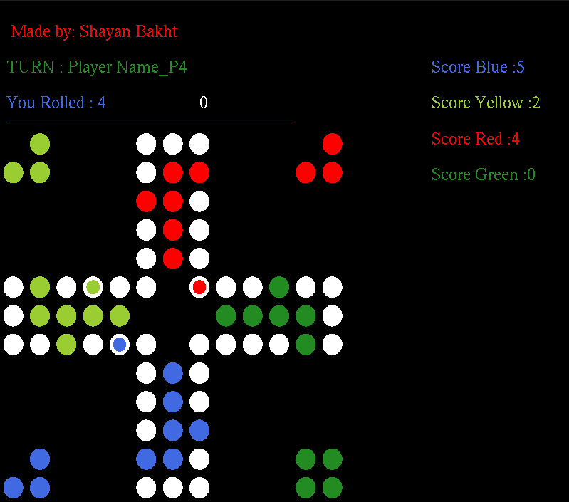

# Ludo_Cpp_Project
 
In this project we are to make a ludo game, using CPP. 

 

## Requirments:- 

This project will run on Ubuntu (linux).
The command " bash install-libraries.sh " has to be used inorder to run the project properly.

## How to play:

The game would start after using the command " ./game " in the terminal. Initially, the terminal will be used for choosing number of players and their colors. 

The Dice can be rolled by pressing "spacebar" and the dice number will be updated. A piece can be unlocked by pressing "Numpad-0-key" when dice rolls 6. By pressing Left-mouse-button, the closest piece would be selected. After selecting the piece, use numpad-keys (1-6)to move the selected piece, be sure to select a piece before moving or else your turn could be skipped. In the "img-vid" folder, theres a video demonstration. 

## Score:
+1 for crossing each square 
+10 for removing piece of an opponent 
+15 for moving a piece into home column

